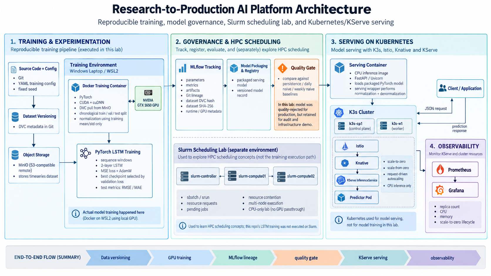
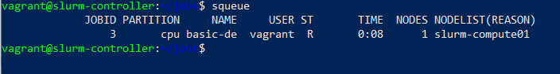
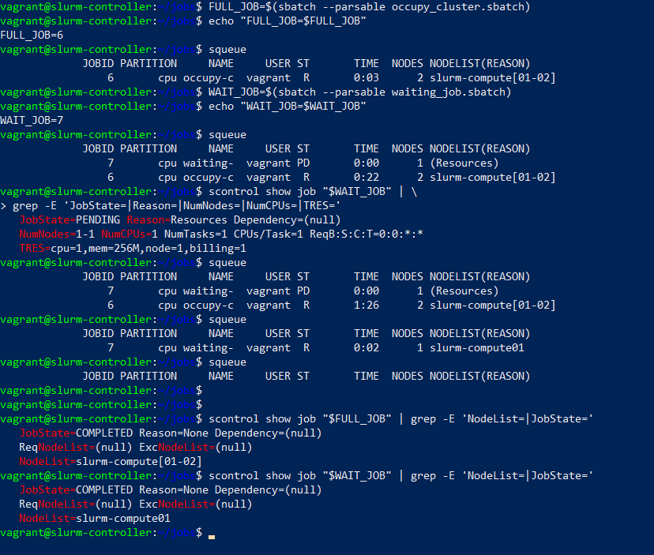
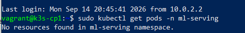
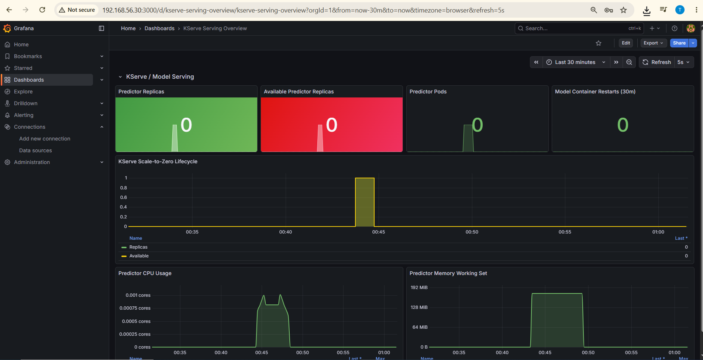
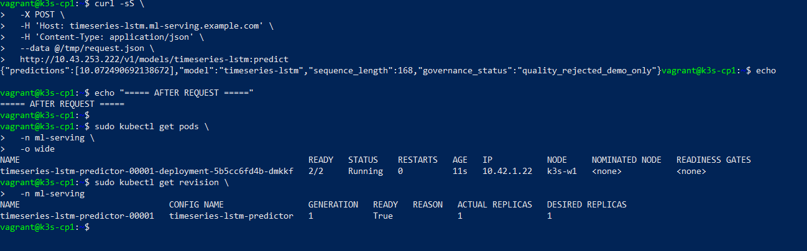
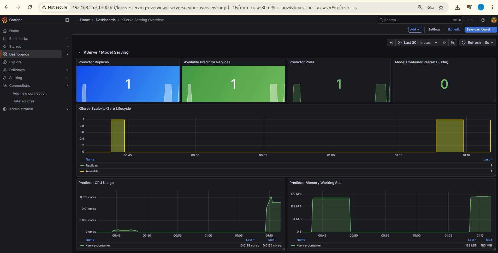

# Research-to-Production AI Platform

Hands-on MLOps and AI infrastructure lab demonstrating the path from model
development to governed deployment, workload scheduling, serverless inference,
and observability.

The project was built as a resource-constrained laptop lab to practice the
infrastructure patterns used in production AI platforms.

## Architecture

The platform separates the ML lifecycle into reproducible training and
experimentation, model governance, HPC scheduling experiments, and
Kubernetes-based model serving.

### End-to-End Flow

    DVC + MinIO
         |
         v
    PyTorch GPU Training
         |
         v
    MLflow Tracking / Registry
         |
         v
    Model Quality Gate
         |
         v
    KServe / Knative / Kubernetes
         |
         v
    Prometheus + Grafana

The Slurm environment is a separate three-node HPC scheduling lab used to
demonstrate resource allocation, multi-node jobs, contention, pending states,
and scheduler behavior.

The PyTorch LSTM training itself was executed in a CUDA-enabled Docker
container on the local NVIDIA GPU through WSL2. It was not executed through
the Slurm cluster.

## What This Project Demonstrates

### Reproducible ML Training

- PyTorch LSTM time-series forecasting
- deterministic training configuration
- CPU and GPU execution
- batch-size and mixed-precision experiments
- immutable Git and container lineage

### Dataset Versioning

- DVC-managed dataset metadata
- MinIO S3-compatible remote storage
- dataset version recorded in MLflow
- SHA-256 integrity fingerprinting

### MLflow Model Governance

MLflow is used for:

- experiment tracking
- parameters and metrics
- model artifacts
- model registry
- serving contracts
- candidate evaluation

A candidate model was evaluated against persistence, daily-naive, and weekly
baselines.

The model was technically valid but failed the quality gate, so promotion was
rejected.

This is intentional: the platform demonstrates that successful training does
not automatically mean production approval.

### Slurm Workload Scheduling

A three-node virtual Slurm lab demonstrates:

- controller and compute-node architecture
- job submission
- multi-node execution
- resource allocation
- pending jobs caused by resource contention
- automatic scheduling when resources become available
- job cancellation and exit-state inspection

The virtual nodes are used for scheduler and operational learning rather than
performance benchmarking.

### Kubernetes and KServe

A two-node K3s cluster hosts the serving platform:

- K3s
- Istio
- Knative Serving
- KServe
- custom PyTorch inference container

The model-serving lifecycle demonstrates:

    0 replicas
        |
        | inference request
        v
    Knative cold start
        |
        v
    predictor pod provisioned
        |
        v
    prediction served
        |
        | idle timeout
        v
    0 replicas

The serving model remains explicitly marked:

    quality_rejected_demo_only

It is deployed only to demonstrate the infrastructure path.

### Observability

The serving stack is monitored with:

- Prometheus
- kube-state-metrics
- kubelet / cAdvisor metrics
- Grafana

Validated metrics include:

- predictor replica count
- available replicas
- predictor CPU usage
- predictor memory working set
- pod lifecycle

## Repository Structure

    configs/
        Training configuration

    data/
        DVC-managed dataset metadata

    src/
        Model and training implementation

    experiments/
        MLflow evaluation and governance experiments

    artifacts/
        Local training checkpoints and evaluation artifacts

    infra/
        slurm/
            Three-node Slurm Vagrant lab

        k3s/
            Two-node K3s / KServe serving lab
            monitoring/
                Prometheus and Grafana configuration

    docs/
        experiments/
            Experiment findings and model quality-gate documentation

        screenshots/
            Slurm and KServe demonstration evidence

        superpowers/
            Architecture specifications and implementation plans

## Key Technologies

| Area | Technology |
|---|---|
| Training | PyTorch |
| GPU | CUDA |
| Experiment Tracking | MLflow |
| Dataset Versioning | DVC |
| Object Storage | MinIO |
| Containers | Docker |
| Training Scheduler | Slurm |
| Kubernetes | K3s |
| Model Serving | KServe |
| Serverless Serving | Knative |
| Service Mesh / Ingress | Istio |
| Metrics | Prometheus |
| Kubernetes State | kube-state-metrics |
| Visualization | Grafana |
| Infrastructure Lab | Vagrant + VirtualBox |

## Important Scope Notes

This repository is a hands-on infrastructure and MLOps learning lab.

It does not claim:

- production HPC performance
- production Kubernetes high availability
- production GPU scheduling
- production security hardening
- production Prometheus HA
- long-term monitoring storage

The virtual Slurm environment is used to understand scheduler behavior and
operations.

The KServe environment uses CPU inference because the Kubernetes VMs do not
have GPU passthrough.

---

## Demo Evidence

### Slurm Scheduling

The Slurm lab demonstrates finite-job scheduling across multiple compute nodes, including normal execution and resource contention.

#### Running Job

#### Resource Contention

A second job remains pending while the cluster resources are occupied, then becomes schedulable once resources are released.

---

### KServe Scale-to-Zero

The serving platform uses KServe in Knative mode.

When the model is idle, the predictor scales completely to zero.

#### Idle — CLI

No predictor pods are running.

#### Idle — Grafana

The observability dashboard shows zero serving replicas and no active predictor resource consumption.

---

### KServe Scale-from-Zero

An inference request triggers a Knative cold start and provisions the predictor workload.

#### Active — CLI

The predictor pod is created and becomes Ready.

#### Active — Grafana

Prometheus and Grafana expose the replica transition together with predictor CPU and memory utilization.

The demonstrated serving lifecycle is:

    idle
      |
      v
    0 predictor replicas
      |
      | inference request
      v
    Knative cold start
      |
      v
    predictor provisioned
      |
      v
    inference served
      |
      v
    CPU / memory observable
      |
      | idle timeout
      v
    0 predictor replicas

> The deployed LSTM is intentionally marked `quality_rejected_demo_only`.
> It is used to demonstrate the infrastructure lifecycle and was not promoted
> through the model quality gate.

